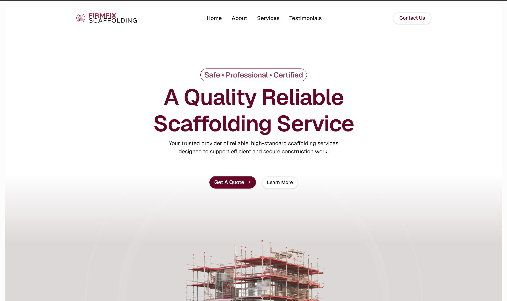

# Firmfix-Scaffolding-WP-Website

> Built and customized a business website for a scaffolding and property services company using WordPress and Elementor. Designed responsive layouts tailored to client's branding across desktop, tablet, and mobile devices. Applied SEO best practices including meta tags, alt texts, and page titles to improve online visibility.

**Live Site:** [firmfix-scaffolding.co.uk](https://firmfix-scaffolding.co.uk/)

---

## 🛠 Built With

This site was built using **WordPress + Elementor's visual page builder**. No custom theme or plugin code was required — my contributions focused on design, layout, configuration, and optimization.

---

## ✨ My Contributions

- Designed and built single-page web layouts using Elementor (home, about, services, testimonials, contact)
- Configured responsive design across mobile/tablet/desktop
- Set up on-page SEO (meta titles, descriptions, sitemap, schema)
- Configured SMTP for reliable contact form email delivery
- Implemented security hardening (login protection, firewall, SSL)

---

## 🖼 Gallery

| Homepage | About Section | Services Section | Testimonials Section | Contact Us Section | Tablet View | Mobile View |
|  |  |  |  |  |  |  |

---

## 🧩 Notable Decisions / Challenges

- **Challenge:** [e.g. Contact form emails weren't being delivered]
  **Solution:** [e.g. Configured SMTP with proper SPF/DKIM records via WP Mail SMTP]

- **Challenge:** [e.g. Slow load times on mobile]
  **Solution:** [e.g. Optimized images, enabled caching plugin]

---

## 📌 Project Notes

- Type: Client Project
- Timeline: Nov 2025 - Dec 2025
- Role: Lead Developer

---

## 📄 License

This documentation is shared for portfolio purposes. Site content and branding belong to the respective site owner.
